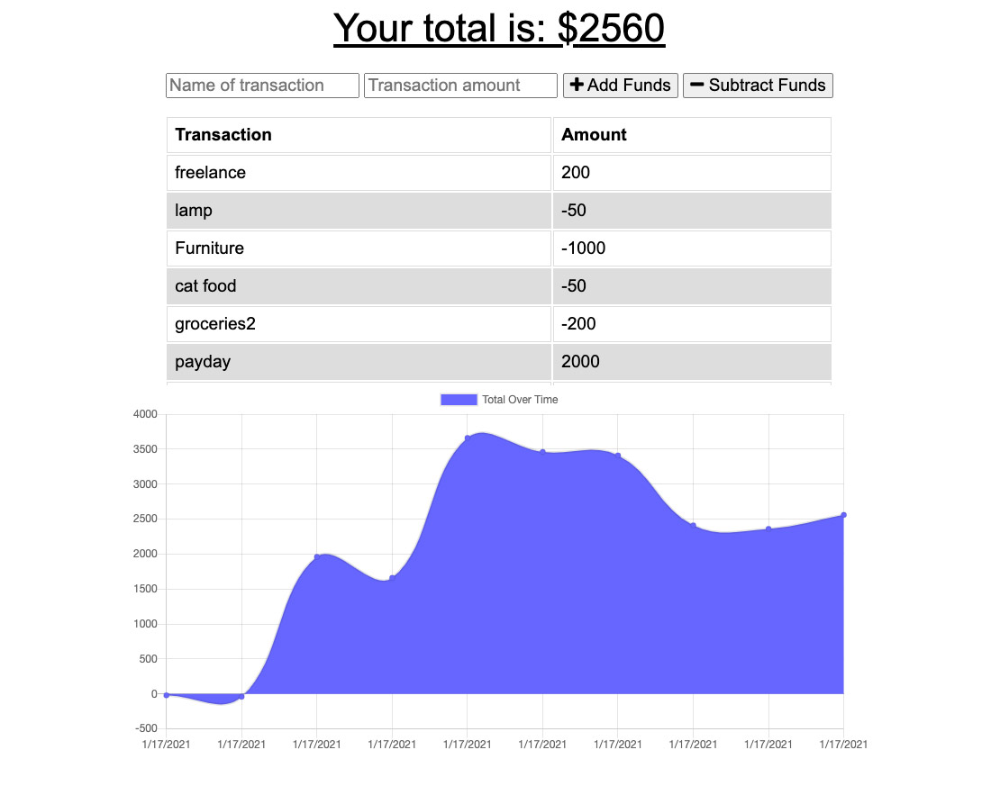

# Budget Tracker

Allows the user to track a budget entries, adding and subtracting from a budget total. The enteries can be saved online or offline. The application uses mongodb and can be installed off the browser. When a user returns online, offline data is updated.

## Description

Created a budget tracking app utilizing Node.js, Express.js, MongoDB, Heroku and Mongoose. A majority of the front-end code was provided as well as functionality of the application. I added code to allow the application to work offline as well as online and track the user entries in the database.

## Livesite:

[application](https://paulsbudgettracker.herokuapp.com/)

## Images

## Installation

You will need to npm init to get all the required node modules. If you are running the code locally the local host is set to port 3000. Run npm start to launch the application

## Usage

The project is to learn and use MongoDB and to work with a front end application for MongoDB and to create a PWA application which can run on and offline. The project could be used to track budgets or similar applications.

## Credits

The project was provided with the majority of the front-end development complete. The server code was developed by myself with help from my instructors and my tutor. 

## Challenges

With the help of my tutor, I wasn't presented with any major challenges. The main focus was to create the files needed to set up the server and to connect with MongoDB and Robo 3T. Also, setting up a virtual tracking was a bit of a challenge. 